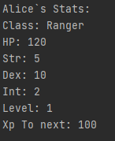
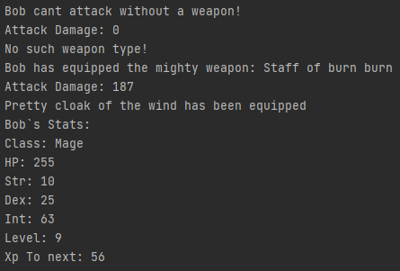
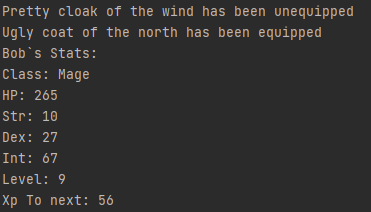

# RPGCharacters
A project to demonstrate the use of various design patterns 

NOTE: The project prints to standard out from multiple different files, this is in this case intended behaviour. 
Several of the places where there is printed, is places where the function would have hooked in with other game logic, 
that havent been implemented, as they are out of the scope of this assignment.

The project allows the user to create heroes, give them a class, a weapon and some equipment.

A new here can be created using the function:
Hero alice = new Hero("HERONAME", HeroClassFactory.getHeroClass("HEROCLASS"));

Stats for the hero can be shown using: HERO OBJECT.printHeroStats();

Before being able to attack an hero needs to equip a weapon, this is done by using the weapon factory and 
calling .equipWeapon on the Hero object.  

HEROOBJECT.equipWeapon(WeaponFactory.getWeaponFactory("Staff of burn burn", 6, "MAGIC"));

Creating and equipping, equipment is done with:
HEROOBJECT.equipItem(EquipmentFactory.getEquipmentFactory("Pretty cloak of the wind",
5, "CLOTH", "BODY"));

If the slot the item occupies is already full, the old item is unequiped before equipping the new item.

Multiple examples of how to use the different inbuilt functions can be found in Main